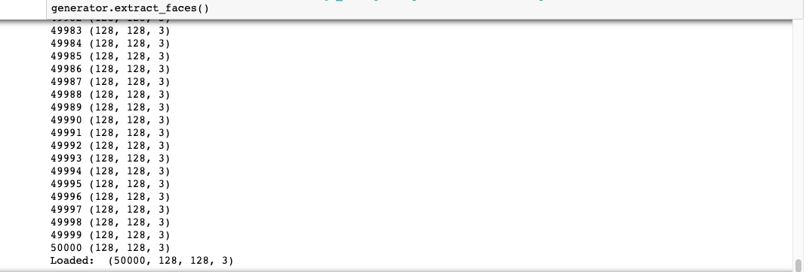
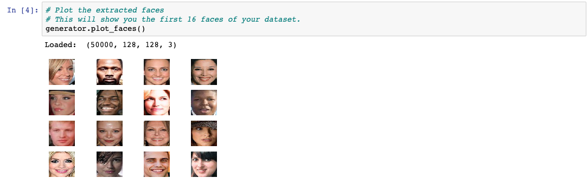
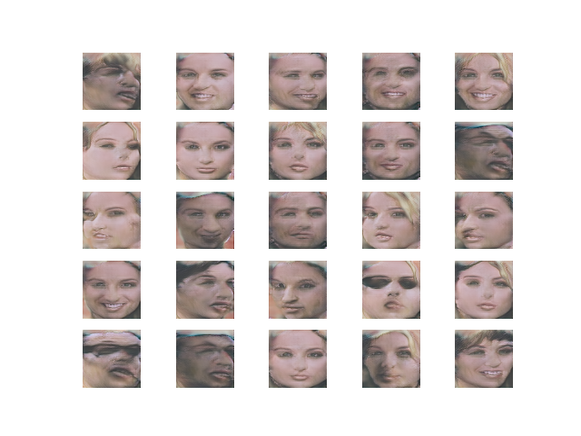

## Deep Learning Faces Generator using Generative Adversarial Networks (GANs)

Faces generator that can generate random 128x128 faces using celebrities faces as training set. 

To use this generator you need install the following packages.

```
mtcnn==0.1.0
numpy==1.16.4
Keras==2.3.1
Keras-Applications==1.0.8
Keras-Preprocessing==1.1.0
Pillow==7.0.0
scikit-image==0.16.2
scikit-learn==0.21.3
scipy==1.4.1
matplotlib==3.1.1
```

You can do that by running this command:

```
pip install -r requirements.txt
```

This project is based on the article [How to Train a Progressive Growing GAN in Keras for Synthesizing Faces](https://machinelearningmastery.com/how-to-train-a-progressive-growing-gan-in-keras-for-synthesizing-faces/) by [Jason Brownlee](https://machinelearningmastery.com/author/jasonb/), that is why we are going to use the [Large-scale Celebrity Faces Attributes Dataset](http://mmlab.ie.cuhk.edu.hk/projects/CelebA.html) as well.

After decompressing the `img_align_celeba.zip` file (that contains a fair number of celebrity faces) and moving its contents into your `faces/` directory, you can open an IPython interpreter or a Jupyter Notebook in the current directory (the directory you cloned this project into) and start creating an instance of faces generator.

The images the faces generator will create will increase in resolution starting by 4x4, 8x8, 16x16 all the way to 128x128 you will see the resolution progress in the files generated (eg. `plot_016x016-tuned.png`).

First start by importing the FaceGenerator.

```python
from faces_generator import FacesGenerator
```

The next line creates an instance of the FacesGenerator, it will receive a directory containing the faces to be trained.
```python
generator = FacesGenerator(example_faces_dir='faces/')
```
The next line will extract the faces found in the images of the `faces/` directory and create a dataset file in your root directory called `imgs_128.npz` compressed to be used by the GANs.
```python
generator.extract_faces(dataset_file_name='imgs_128.npz')
```



The next line will show you the first 16 faces of the `imgs_128.npz` dataset file.

```python
generator.plot_faces(dataset_file_name='imgs_128.npz')
```



This line will generate the new faces, they will appear in your root directory in png and h5 format like this:

* plot_128x128-tuned.png
* model_128x128-tuned.h5

```python
generator.generate_faces(dataset_file_name='imgs_128.npz')
````



